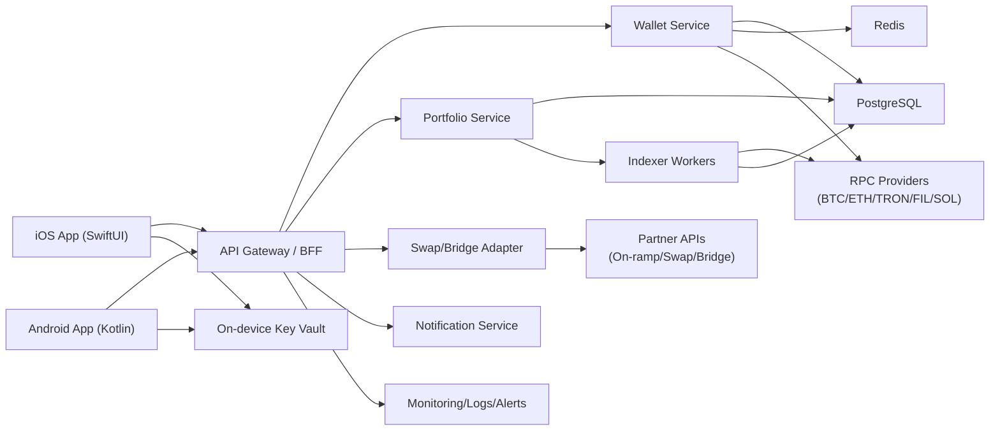

# IMWALLET_DEVELOPMENT_PLAN

KR | [中文](#中文) | [English](#english)

## KR

## 1) 문서 목적
이 문서는 IMWallet 개발 착수 전, 제품 범위와 기술 아키텍처, 인프라 용량 계획을 확정하기 위한 개발 기준서다.

> 2026-05-01 운영 결정(1기/2기 분리 기준)은 [IMWALLET_PHASE_PLAN.md](/Users/heptalabs/Documents/New%20project/SJK/IMWALLET_PHASE_PLAN.md) 문서를 우선 기준으로 따른다.

## 2) 입력 요구사항 요약
- 앱 이름: IMWallet
- 레퍼런스: Trust Wallet
- 목표: 암호화폐 지갑 앱의 핵심/확장 기능 전체 제공
- 1차 지원 자산: 비트코인(BTC), 이더리움(ETH), 트론(TRX), 테더(USDT), 파일코인(FIL), 솔라나(SOL)
- 플랫폼: Android, iOS
- 도메인: `imwallet.app`
- 브랜딩: 심볼/로고는 사용자 제공 자산 사용

## 3) 가정 (명시)
- 가정 A: IMWallet은 비수탁(Non-custodial) 지갑으로 시작한다. 개인키/시드구문은 서버에 저장하지 않는다.
- 가정 B: USDT는 1차에서 `ERC-20`(Ethereum)과 `TRC-20`(TRON)을 우선 지원한다. (SPL/기타 네트워크는 2차)
- 가정 C: 법정화폐 온램프/오프램프, 스왑, 브릿지는 자체 구축보다 파트너 API 연동을 우선한다.
- 가정 D: 서버 스펙은 출시 초기 트래픽(피크 API 200~300 RPS)을 기준으로 산정한다.

## 4) 제품 범위 (Trust Wallet 레퍼런스 기준)
아래 기능은 "최종적으로 모두 제공"을 목표로 하며, 보안/운영 리스크를 낮추기 위해 단계적으로 릴리즈한다.

| 영역 | 세부 기능 | 1차 출시 | 최종 목표 |
|---|---|---|---|
| 지갑 생성/복구 | 신규 생성, 시드구문 복구, 개인키 가져오기, watch-only | 포함 | 포함 |
| 자산 관리 | 멀티체인 계정, 토큰 자동 탐지, 사용자 토큰 추가/숨김 | 포함 | 포함 |
| 송금/수신 | 주소 생성, QR, 수수료 설정, 전송 상태 추적 | 포함 | 포함 |
| 포트폴리오 | 자산 잔고/평가금액, 체인별 필터, 히스토리 | 포함 | 포함 |
| 보안 | PIN/생체인증, 루팅/탈옥 탐지, 민감정보 마스킹 | 포함 | 포함 |
| dApp 연결 | WalletConnect, dApp 세션 관리 | 포함 | 포함 |
| 스왑 | DEX Aggregator 연동, 가격 비교, 슬리피지 설정 | 2차 | 포함 |
| 브릿지 | 체인 간 브릿지 파트너 연동 | 2차 | 포함 |
| 스테이킹 | 네트워크별 스테이킹/언스테이킹/리워드 조회 | 2차 | 포함 |
| NFT | EVM/Solana NFT 조회, 전송, 컬렉션 보기 | 2차 | 포함 |
| 가격 알림 | 관심자산 알림, 급등락 알림 | 2차 | 포함 |
| 매수/매도 | 온램프/오프램프 파트너 연동 | 3차 | 포함 |
| 고급 보안 | 하드웨어 지갑 연동, 위험 트랜잭션 경고 엔진 | 3차 | 포함 |

## 5) 1차 지원 체인 설계

| 자산 | 네트워크 | 주소/표준 | 비고 |
|---|---|---|---|
| BTC | Bitcoin Mainnet | Base58/Bech32 | UTXO 모델 |
| ETH | Ethereum Mainnet | EVM, ERC-20 | EIP-1559 수수료 |
| TRX | TRON Mainnet | TRON, TRC-20 | 에너지/대역폭 모델 |
| USDT | Ethereum, TRON | ERC-20, TRC-20 | 가정 B 기준 |
| FIL | Filecoin Mainnet | f-address | 메시지/가스 모델 별도 |
| SOL | Solana Mainnet | SOL, SPL | 계정/렌트 구조 고려 |

## 6) 시스템 아키텍처 (초안)

핵심 원칙:
- 개인키 서명은 앱 내부에서 수행하고 서버는 서명된 트랜잭션만 브로드캐스트한다.
- 체인 연동은 초기엔 Managed RPC를 사용하고, 트래픽 증가 시 핵심 체인부터 자체 노드 병행으로 전환한다.

## 7) 서버 수량 및 스펙

### 7.1 권장안 (Managed RPC 중심, 프로덕션)

| 구분 | 수량 | 권장 스펙 (1대 기준) | 용도 |
|---|---|---|---|
| API/BFF 서버 | 3대 | 4 vCPU / 8 GB RAM / 100 GB SSD | 인증, 세션, API 라우팅 |
| 백그라운드 워커 | 2대 | 4 vCPU / 8 GB RAM / 100 GB SSD | 트랜잭션 상태동기화, 큐 처리 |
| 인덱서 워커 | 2대 | 8 vCPU / 16 GB RAM / 200 GB SSD | 멀티체인 데이터 동기화 |
| PostgreSQL Primary | 1대 | 8 vCPU / 32 GB RAM / 1 TB NVMe | 운영 DB |
| PostgreSQL Replica | 1대 | 8 vCPU / 32 GB RAM / 1 TB NVMe | 읽기 분산, 장애 복구 |
| Redis Cluster | 3대 | 2 vCPU / 8 GB RAM / 50 GB SSD | 캐시, 세션, 큐 |
| 모니터링 서버 | 1대 | 4 vCPU / 16 GB RAM / 200 GB SSD | 로그/메트릭 수집 |
| 배스천/VPN 서버 | 1대 | 2 vCPU / 4 GB RAM / 50 GB SSD | 운영 접근 제어 |

- 프로덕션 총량: **14대**
- 별도 Managed 서비스(서버 수량 미포함): CDN/WAF, 오브젝트 스토리지, KMS, 푸시 발송 서비스

### 7.2 환경별 최소 권장 수량

| 환경 | 서버 수량 | 설명 |
|---|---:|---|
| Dev | 4대 | API 1, Worker 1, DB 1, Redis 1 |
| Staging | 6대 | API 2, Worker 1, DB 1, Redis 1, Monitoring 1 |
| Production | 14대 | 7.1 표 기준 |

### 7.3 대안 (자체 체인 노드 운영 시 추가분)
아래는 7.1 권장안에 추가되는 노드 서버다.

| 체인 | 추가 수량 | 권장 스펙 (1대 기준) |
|---|---:|---|
| Bitcoin Full Node | 2대 | 8 vCPU / 32 GB / 4 TB NVMe |
| Ethereum Execution Node | 2대 | 16 vCPU / 64 GB / 4 TB NVMe |
| Ethereum Consensus Node | 2대 | 4 vCPU / 16 GB / 500 GB SSD |
| TRON Full Node | 2대 | 16 vCPU / 64 GB / 4 TB NVMe |
| Filecoin Node | 2대 | 32 vCPU / 128 GB / 8 TB NVMe |
| Solana RPC Node | 2대 | 24 vCPU / 256 GB / 2 TB NVMe |

- 자체 노드 추가분: **12대**
- 자체 노드 포함 총량: **26대 (14 + 12)**

## 8) 도메인/네트워크 설계 (`imwallet.app`)
- `imwallet.app`: 서비스 소개/다운로드 랜딩
- `api.imwallet.app`: 앱 API 엔드포인트
- `assets.imwallet.app`: 토큰 아이콘/정적 리소스
- `link.imwallet.app`: Universal Link / Android App Link
- `status.imwallet.app`: 상태 페이지(장애 공지)

## 9) 모바일 앱 기술 설계
- iOS: Swift + SwiftUI
- Android: Kotlin + Jetpack Compose
- 공통 암호화 코어: Rust 기반 Wallet Core 모듈(모바일 네이티브 바인딩)
- 공통 정책: Secure Enclave/Keystore 사용, 시드구문 스크린샷/클립보드 노출 최소화

## 10) 보안/운영 필수 기준
- 시드구문/개인키 서버 저장 금지
- 민감 데이터 암호화(AES-256 at rest, TLS 1.2+ in transit)
- 서명 전 트랜잭션 시뮬레이션 및 위험 알림
- 운영자 콘솔 MFA, IP 제한, 감사 로그 보관
- CI 단계 SAST/DAST/의존성 취약점 스캔 적용
- 메이저 릴리즈 전 외부 보안감사 필수

## 11) 개발 단계 제안

| 단계 | 기간(가정) | 핵심 결과물 |
|---|---|---|
| Phase 0 | 2주 | 아키텍처 고정, 위협 모델링, 저장소/CI 기본 구성 |
| Phase 1 | 4주 | 지갑 생성/복구, BTC/ETH/TRON/USDT 송수신 |
| Phase 2 | 4주 | FIL/SOL 지원, 포트폴리오/히스토리, WalletConnect |
| Phase 3 | 4주 | 스왑/브릿지, NFT, 가격 알림 |
| Phase 4 | 3주 | 스테이킹, 온램프/오프램프, 운영 콘솔 |
| Phase 5 | 3주 | 보안감사 대응, 앱스토어 배포 준비 |

## 12) 다음 문서(개발 착수 직전)
1. `IMWALLET_TECH_SPEC.md` (API/모듈 상세 명세)
2. `IMWALLET_SECURITY_MODEL.md` (위협 모델/보안 통제)
3. `IMWALLET_RELEASE_PLAN.md` (마일스톤/QA/스토어 제출)

---

## 中文

### 摘要
- IMWallet 将以 Trust Wallet 为参考，最终覆盖钱包核心与扩展能力（钱包创建/恢复、转账、资产管理、dApp、Swap、Bridge、Staking、NFT、法币出入金等）。
- 首批重点资产为 BTC、ETH、TRON、USDT、FIL、SOL，其中 USDT 优先支持 ERC-20 与 TRC-20。
- 推荐基础设施方案（生产）为 **14 台服务器**（Managed RPC 模式）；若自建链节点，需额外 **12 台**，总计 **26 台**。
- 域名规划：`imwallet.app`, `api.imwallet.app`, `assets.imwallet.app`, `link.imwallet.app`, `status.imwallet.app`。
- 技术建议：iOS(SwiftUI) + Android(Compose) + Rust 钱包核心，共享加密逻辑并强化终端密钥安全。

---

## English

### Summary
- IMWallet is planned to reach full wallet capability parity (core + advanced): wallet creation/recovery, transfers, portfolio, dApp connectivity, swap/bridge, staking, NFT, and fiat on/off-ramp integrations.
- Initial assets: BTC, ETH, TRON, USDT, FIL, SOL. USDT priority networks are ERC-20 and TRC-20.
- Recommended production baseline is **14 servers** under a Managed RPC approach; self-hosted chain nodes add **12** more (total **26**).
- Domain map: `imwallet.app`, `api.imwallet.app`, `assets.imwallet.app`, `link.imwallet.app`, `status.imwallet.app`.
- Suggested mobile architecture: native iOS/Android apps with a shared Rust wallet core and strict on-device key custody.
